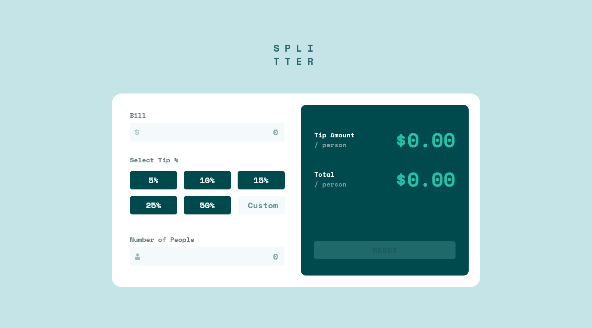
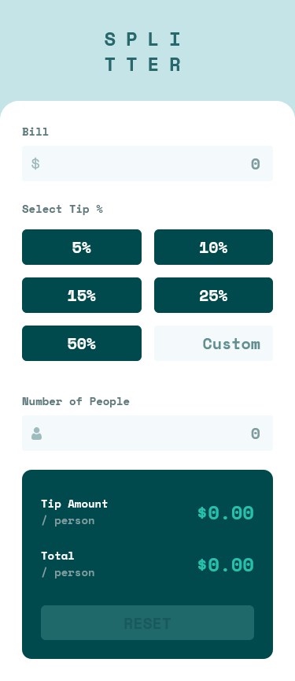

# Frontend Mentor - Tip calculator app solution

This is a solution to the [Tip calculator app challenge on Frontend Mentor](https://www.frontendmentor.io/challenges/tip-calculator-app-ugJNGbJUX). Frontend Mentor challenges help you improve your coding skills by building realistic projects.

## Table of contents

- [Overview](#overview)
  - [The challenge](#the-challenge)
  - [Screenshot](#screenshot)
  - [Links](#links)
- [My process](#my-process)
  - [Built with](#built-with)
  - [Useful resources](#useful-resources)
- [Author](#author)

## Overview

### The challenge

Users should be able to:

- View the optimal layout for the app depending on their device's screen size
- See hover states for all interactive elements on the page
- Calculate the correct tip and total cost of the bill per person

### Screenshot

#### Desktop

#### Mobile

### Links

- Solution URL: [https://github.com/Akiz-Ivanov/tip-calculator-app](https://github.com/Akiz-Ivanov/tip-calculator-app)
- Live Site URL: [https://akiz-ivanov.github.io/tip-calculator-app/](https://akiz-ivanov.github.io/tip-calculator-app/)

## My process

### Built with

#### Design
- [Frontend Mentor](https://www.frontendmentor.io/) - Challenge platform

### Useful resources

- [Transfonter](https://transfonter.org/) – Excellent web tool to convert and subset custom fonts into web-ready formats (`.woff`, `.woff2`). I used it to import and optimize the font(s) provided by the design. It also generates ready-to-use `@font-face` CSS.

## Author

- Frontend Mentor - [@Akiz97](https://www.frontendmentor.io/profile/Akiz97)
- GitHub - [@Akiz-Ivanov](https://github.com/Akiz-Ivanov)